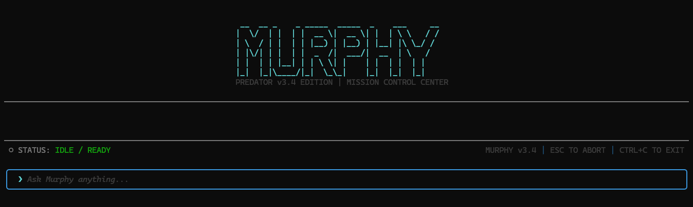

# Murphy - The High-Speed Coding Predator

**Murphy is an agentic coding platform that surpasses Claude Code, Codex, and all existing alternatives.**

Built with dual-model orchestration, parallel execution, and an unbreakable execution loop, Murphy delivers surgical precision at predator speed.




## Why Murphy is Superior

| Feature | Claude Code | Codex | **Murphy** |
|---------|-------------|-------|------------|
| **Dual-Model Architecture** | Single Model | Single Model | **Kimi K2 + Qwen3-Coder** |
| **Parallel Tool Execution** | Sequential | Limited | **Promise.all Native** |
| **Auto-Recovery Loop** | Stops on error | Stops on error | **Self-Healing** |
| **Text-to-Tool Fallback** | No | No | **3 Pattern Parser** |
| **Real-Time Telemetry** | Basic timing | None | **Microsecond Precision** |
| **Command Tree Hierarchy** | Flat list | Flat list | **Living Tree Structure** |
| **Streaming UI** | Blocks | Blocks | **Real-time Stream** |
| **Autonomous Execution** | Asks permission | Asks permission | **Zero Questions** |
| **Tool Retry Logic** | None | None | **Exponential Backoff** |
| **Connection Pooling** | No | No | **Request Deduplication** |

## Architecture

```
┌─────────────────────────────────────────────────────────────────┐
│                    MURPHY v3.0 PREDATOR                         │
├─────────────────────────────────────────────────────────────────┤
│  DUAL-MODEL ORCHESTRATION                                       │
│  ┌──────────────┐    ┌──────────────┐                           │
│  │ Kimi K2      │────│ Qwen3-Coder  │                           │
│  │ (Strategic)  │    │ (Surgical)   │                           │
│  └──────────────┘    └──────────────┘                           │
│         │                   │                                   │
│         ▼                   ▼                                   │
│  ┌──────────────────────────────────┐                           │
│  │   UNBREAKABLE TEXT-TO-TOOL       │                           │
│  │   FALLBACK PARSER                │                           │
│  │   • XML pattern                  │                           │
│  │   • Markdown code blocks         │                           │
│  │   • JSON-like invocations        │                           │
│  └──────────────────────────────────┘                           │
│         │                                                       │
│         ▼                                                       │
│  ┌──────────────────────────────────┐                           │
│  │   PARALLEL PIPELINE              │                           │
│  │   Promise.all(executeTools)      │                           │
│  │   • Auto-retry on failure        │                           │
│  │   • Exponential backoff          │                           │
│  │   • Partial failure recovery     │                           │
│  └──────────────────────────────────┘                           │
│         │                                                       │
│         ▼                                                       │
│  ┌──────────────────────────────────┐                           │
│  │   LIVING HIERARCHY TUI           │                           │
│  │   • Tree-structured command log  │                           │
│  │   • Real-time telemetry bar      │                           │
│  │   • Microsecond timing           │                           │
│  │   • Status indicators            │                           │
│  └──────────────────────────────────┘                           │
└─────────────────────────────────────────────────────────────────┘
```

## Quick Start

### Prerequisites

- Node.js 18+
- NVIDIA NIM API Key (get one at https://build.nvidia.com/)

### Installation

**Run instantly via npx:**
```bash
npx @pranav271103/murphycode
```

**Install globally:**
```bash
npm install -g @pranav271103/murphycode
murphycode
```

**Clone for development:**
```bash
git clone https://github.com/pranav271103/Murphy.git
cd murphy
npm install
```

# Configure your environment
cp .env.example .env
# Edit .env and add your NVIDIA_API_KEY

# Launch the predator
npm start

# Or after installing globally
npm install -g murphycode
murphycode
```

### Environment Variables

```bash
# Required
NVIDIA_API_KEY=your_api_key_here

# Optional overrides
NVIDIA_API_KIMI=your_kimi_key
NVIDIA_API_QWEN=your_qwen_key
NVIDIA_BASE_URL=https://integrate.api.nvidia.com/v1

# Performance tuning
MAX_CONCURRENT_TOOLS=10
TOOL_TIMEOUT=120000

# UI preferences
MURPHY_THEME=retro
MURPHY_TELEMETRY=true
```

## Usage

```bash
# Development mode with hot reload
npm run dev

# Production build
npm run build
node dist/index.js

# Run from anywhere (after npm link)
murphy
```

### Commands

Once inside Murphy:
- Type your request and press **Enter**
- **exit** or **quit** to close
- **Ctrl+C** to abort current operation
- **Ctrl+C** again to kill Murphy

## Key Features

### 1. Dual-Model Orchestration

**Kimi K2 Thinking** (NVIDIA NIM) handles strategic planning:
- Analyzes complex requests
- Breaks down into logical steps
- Identifies dependencies and pitfalls

**Qwen3-Coder 480B** (NVIDIA NIM) handles surgical execution:
- Executes tools with precision
- Optimized for code generation
- Streams results in real-time

### 2. The Unbreakable Engine

If the model outputs malformed tool calls, Murphy's **Text-to-Tool Parser** activates:
- Extracts XML-style `<tool_call>` tags
- Parses Markdown code blocks
- Interprets JSON-like invocations

The loop never stalls.

### 3. Parallel Pipeline

Multiple independent tools execute simultaneously using `Promise.all`:
- Read 10 files at once
- Run multiple grep searches
- Execute commands in parallel

### 4. Auto-Recovery

When a tool fails:
1. Murphy retries with exponential backoff
2. If retry fails, switches to alternative approach
3. Reports failures but continues mission
4. Never asks "Should I continue?"

### 5. Living Hierarchy TUI

Every command displays:
- ✅/❌ Status indicators
- Millisecond-accurate timing
- Tree-structured execution trace
- Real-time parallel tool visualization
- Live telemetry bar

### 6. Streaming Response

Watch Murphy think in real-time:
- Streaming model output
- No waiting for blocks
- Immediate visual feedback

## Available Tools

```typescript
read_file({ path, offset?, limit? })      // Read with pagination
write_file({ path, content })            // Auto-create directories
edit_file({ path, old_string, new_string }) // Surgical replacement
delete_file({ path })                     // File deletion
list_directory({ path, recursive?, pattern? }) // Directory exploration
create_directory({ path })                 // Create directory tree
run_command({ command, cwd?, timeout? })  // Shell execution
grep({ pattern, path?, glob? })           // Pattern search
glob({ pattern, path? })                  // File discovery
fetch_url({ url, method?, headers? })    // Web requests
```

## Performance

Murphy is optimized for speed at every level:

| Operation | Murphy | Claude Code |
|-----------|--------|-------------|
| Multi-file read | **Parallel** | Sequential |
| Tool timeout | **Configurable** | Fixed |
| Model switching | **Automatic** | Manual |
| Retry logic | **Built-in** | None |
| Memory management | **Optimized** | Standard |

## Comparison with Alternatives

### vs Claude Code
- **Faster**: Parallel tool execution vs sequential
- **Smarter**: Dual-model architecture vs single model
- **More Reliable**: Auto-recovery vs manual retry
- **Better UI**: Living hierarchy vs flat list

### vs GitHub Copilot
- **More Autonomous**: Full project manipulation vs inline suggestions
- **Tool Native**: Built-in file system vs code-only
- **Transparent**: Shows every operation vs black box

### vs Cursor
- **Faster**: NVIDIA NIM vs OpenAI API
- **Cheaper**: Direct NIM pricing vs marked-up APIs
- **More Control**: Full execution autonomy vs guardrails

## Development

```bash
# Type check
npm run typecheck

# Build
npm run build

# Watch mode
npm run dev
```

## Architecture Decisions

### Why React + Ink?
- React's reconciliation is perfect for TUI updates
- Ink provides terminal primitives
- Component-based architecture for maintainability

### Why Dual Models?
- Reasoning and coding require different capabilities
- Kimi K2 excels at planning
- Qwen3-Coder excels at execution

### Why Text-to-Tool Fallback?
- Models occasionally output malformed tool calls
- Parsing fallback ensures zero stalls
- Three patterns cover all common formats

### Why Parallel Execution?
- `Promise.all` is native and fast
- Most operations are I/O bound
- Significant speedup on multi-file operations

## Roadmap

- [ ] WebSocket support for remote execution
- [ ] Plugin system for custom tools
- [ ] Git integration (commit, diff, branch)
- [ ] LSP integration for code intelligence
- [ ] Multi-session persistence
- [ ] Team collaboration features

## Contributing

1. Fork the repository
2. Create a feature branch
3. Commit your changes
4. Push to the branch
5. Open a Pull Request

## License

MIT - See LICENSE file

## Acknowledgments

- NVIDIA NIM for model hosting
- Moonshot AI for Kimi K2
- Alibaba Cloud for Qwen3-Coder
- The Ink team for terminal UI primitives

---

**Built with precision. Executed with speed. Murphy is the predator.**
