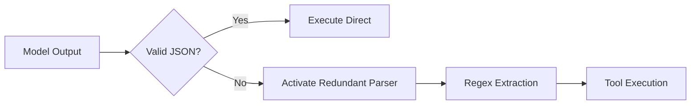

# 🧠 Predator Anatomy: Architecture

Murphy's dominance is mathematically derived from its multi-layer architecture.

---

## 🏗️ The Dual-Model Brain

Murphy separates "Thinking" from "Doing" to prevent the logical stalls common in single-model agents.

### 1. The Strategic Core (Kimi K2)
Kimi K2 functions as the **General**. It does not code; it plans. It analyzes the entire codebase and defines the path forward.
- **Strength**: Long-context reasoning & massive planning trees.
- **Latency**: Sub-30s planning cycles.

### 2. The Surgical Blade (Qwen3-Coder)
Qwen3-Coder functions as the **Operator**. It receives orders from Kimi and executes them with surgical precision.
- **Strength**: Elite coding ability & tool-calling fidelity.
- **Execution**: Real-time streaming output.

---

## 🔗 The Unbreakable Engine

Even if a model hallucinations a tool call, Murphy has a redundant **Text-to-Tool Parser**.

### 🚄 Parallelized Pipeline
Unlike other agents that read files one-by-one, Murphy uses `Promise.all` to saturate its I/O bandwidth.
- **Batch Processing**: Up to 10 concurrent tools.
- **Zero Stall**: If one file fails, the rest continue.

---

## 💾 Session Intelligence

Every mission is persisted to `.murphy_session.json` using **Atomic Writes**.
- **Resilience**: Even if the power fails, your history survives.
- **Pruning**: Murphy automatically manages token context to keep your missions fast and cheap.

---

## 🖥️ UI Stack
- **React + Ink**: The core of the Living Hierarchy TUI.
- **Error Boundaries**: Native React crash protection ensuring Murphy stays online during extreme bugs.
