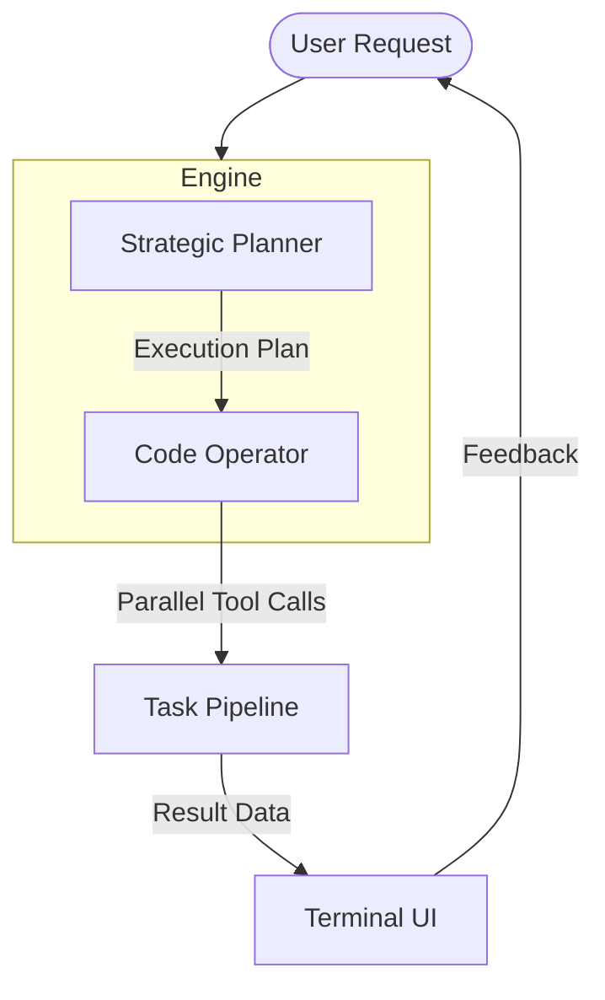

# Murphy Documentation

  
  <h3>Efficient. Reliable. Autonomous.</h3>

Murphy is an agentic coding assistant designed for high-performance software engineering tasks. It utilizes a dual-model orchestration system to combine strategic planning with precise code execution, ensuring robust and reliable results.

---

## Core Capabilities

- **Dual-Model Orchestration**: Leverages Kimi K2 for high-level planning and Qwen-Coder for detailed implementation.
- **Parallel Tool Execution**: Executes multiple file and system operations concurrently to maximize throughput.
- **Self-Healing Loop**: Automatically identifies and recovers from execution errors or malformed model outputs.
- **Persistence**: Maintains conversation state and session history across restarts using atomic JSON storage.

---

## Comparison with Existing Tools

| Capability | Standard Assistants | Murphy |
| :--- | :--- | :--- |
| **Orchestration** | Single Model | Dual-Model (Kimi + Qwen) |
| **Execution** | Sequential | Parallel (Async Pipeline) |
| **Reliability** | Fail-on-error | Automated Recovery Loop |
| **Interface** | CLI / Chat | Real-time TUI |

---

## System Overview

---

## Getting Started

To begin using Murphy, follow our [Installation Guide](installation.md) or explore the [Usage Guide](usage.md) to understand the command hierarchy and toolset.
