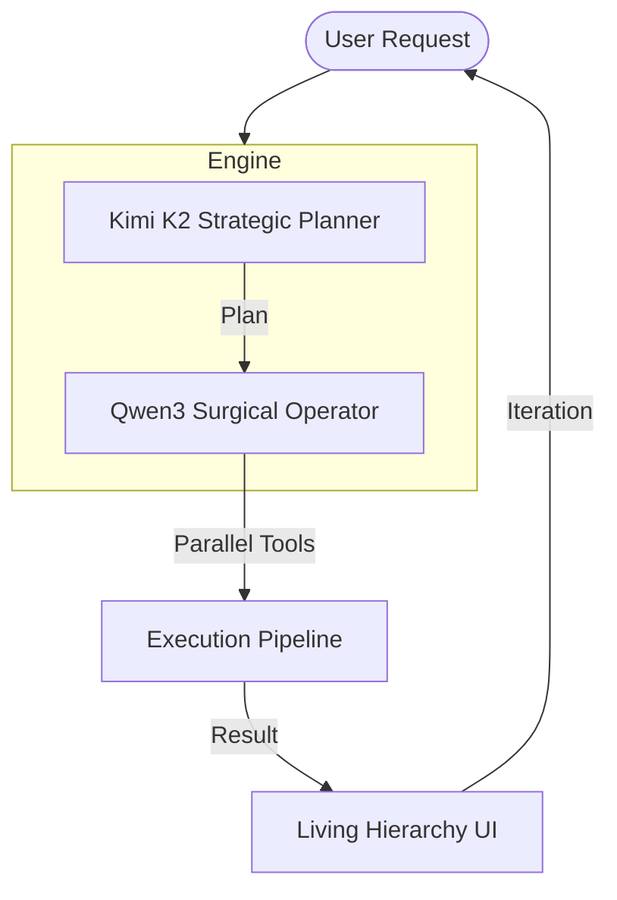

# ⚡ MURPHY: THE HIGH-SPEED CODING PREDATOR

  
  <h3>Surgical Precision. Extreme Speed. Zero Hesitation.</h3>

---

## 🦅 Mission Objective

Murphy is not just another coding assistant. It is an **Agentic Predator** designed to surpass Claude Code, Codex, and existing alternatives through a dual-model orchestration pipeline, parallelized tool execution, and an unbreakable self-healing loop.

!!! tip "Predator v3.2 is Online"
    The latest build features **Atomic Session Persistence**, **Interactive TUI Navigation**, and **NVIDIA NIM** optimized execution.

---

## ⚡ Why Murphy Dominates

| Capability | The Competition | **MURPHY** |
| :--- | :--- | :--- |
| **Orchestration** | Single Model | **Kimi K2 + Qwen3-Coder** |
| **Execution** | Sequential | **Parallel Pipeline (Promise.all)** |
| **Stability** | Stops on Error | **Self-Healing Loop** |
| **Interface** | Basic Text | **Living Hierarchy TUI** |
| **Memory** | Volatile | **Atomic JSON Persistence** |

---

## 🏗️ Core Architecture

---

## 🔥 Next Steps

- [**Install the Predator**](installation.md)
- [**Master Operation**](usage.md)
- [**Explore the Tools**](tools.md)
